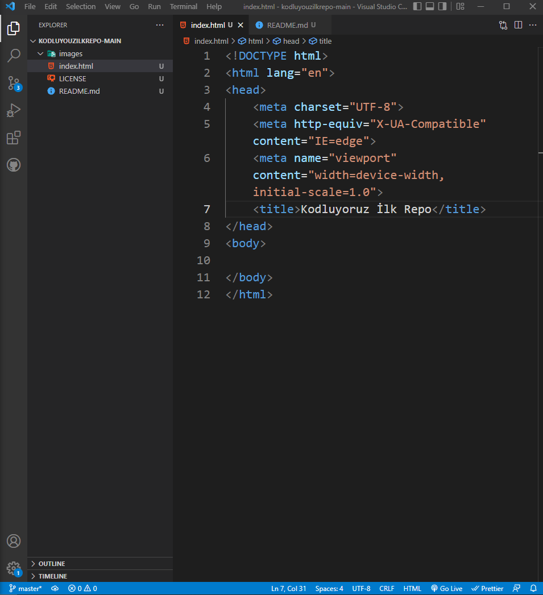

👋 Hi, I’m @uzungh
👀 I’m interested in music, art, books, sports, video games.
🌱 I’m currently learning JavaScript.
📫 How to reach me ---> furkanuzun.u@gmail.com
 
Patika Profilim: https://app.patika.dev/ressuv

# kodluyouzilkrepo
Kodluyoruz Front-end first repo
Bu repo Kodluyoruz Front-End Eğitiminde oluşturduğumuz ilk repo. İçerisinde bir adet README dosyası, bir adet de index.html barındırıyor.

## Installation
Öncelikle projeyi clonelayın. (Buraya sizin reponuzdan aldığınız link gelecek)
...bash
git clone https://github.com/uzungh/kodluyouzilkrepo.git
...

## Usage
Projeyi cloneladıktan sonra Visual Studio Code programında açınız.

Linux için:

cd kodluyoruzilkrepo
code .
## Contributing
Pull requestler kabul edilir. Büyük değişiklikler için, lütfen önce neyi değiştirmek istediğinizi tartışmak için bir konu açınız.

## License
MIT